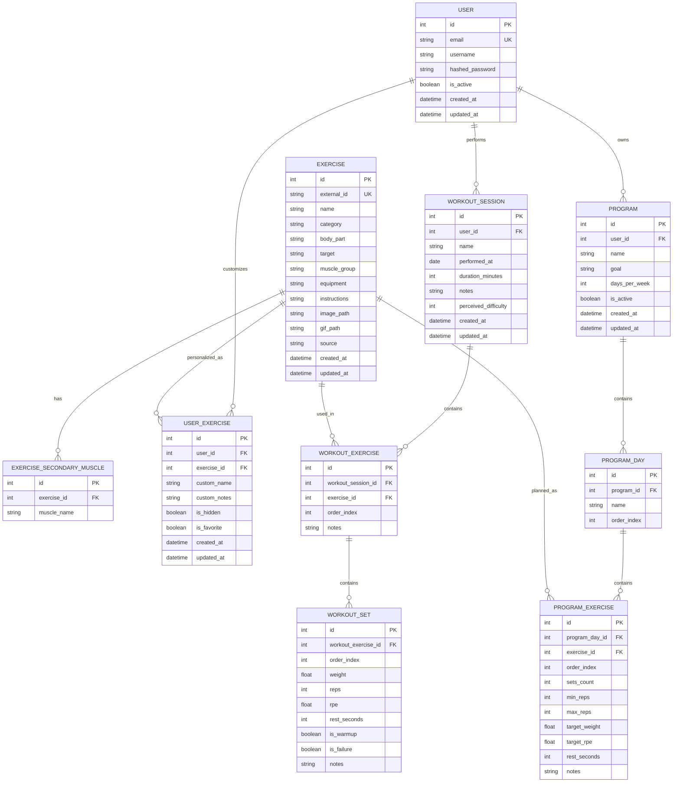

# CobalTrack

CobalTrack est une application web de suivi d'entraînement permettant de gérer ses exercices, séances, programmes et séries.

L'application repose sur une API REST, une interface web responsive et une base de données SQLite pour le démarrage.

## Documentation

- [`docs/DEV_SETUP.md`](docs/DEV_SETUP.md) : installation et lancement local.
- [`docs/DEPLOYMENT.md`](docs/DEPLOYMENT.md) : déploiement sur serveur personnel.
- [`backend/docs/API.md`](backend/docs/API.md) : contrat API REST.

## Objectif

L'objectif de CobalTrack est de permettre à un utilisateur de :

* Suivre ses séances de musculation
* Enregistrer ses exercices et séries
* Visualiser sa progression
* Gérer ses programmes d'entraînement
* Préparer une base évolutive pour de futures versions PWA, Android et desktop

## Scope actuel

Le scope actuel concerne uniquement la version web.

L'application est pensée pour être utilisée depuis un navigateur, avec une interface responsive adaptée au desktop et au mobile.

### Inclus dans le scope web

* Authentification utilisateur
* Gestion des exercices
* Gestion des séances
* Gestion des séries
* Gestion des programmes
* Suivi de progression
* Tableau de bord
* API REST
* Base SQLite
* Interface responsive

### Hors scope actuel

Les éléments suivants ne font pas partie du scope web initial :

* Application Android native
* Application desktop
* Synchronisation offline-first
* Multi-utilisateur public
* Notifications push natives
* Intelligence artificielle générative avancée
* Déploiement sur stores Android ou desktop

## Stack technique

### Frontend

* React
* Vite
* TypeScript
* Interface responsive mobile et desktop

### Backend

* Python
* FastAPI
* API REST
* SQLite
* Alembic pour les migrations

### Base de données

* SQLite pour le démarrage
* Structure prévue pour évoluer sans refonte majeure

## Authentification

L'application prévoit une authentification simple et sécurisée.

Fonctionnalités prévues :

* Création de compte
* Connexion
* Déconnexion
* Récupération de l'utilisateur connecté
* Protection des routes privées
* Association des données à l'utilisateur connecté

Routes prévues :

```http
POST /api/auth/register
POST /api/auth/login
GET  /api/auth/me
POST /api/auth/logout
```

## Exercices

Les exercices servent de référentiel commun pour les séances et les programmes.

L'application peut utiliser une base d'exercices préremplie issue d'un dataset externe. Les exercices sont stockés globalement, puis personnalisables par utilisateur via une table dédiée.

Chaque exercice peut contenir :

* Nom
* Groupe musculaire principal
* Groupes musculaires secondaires
* Catégorie
* Type d'exercice
* Équipement utilisé
* Instructions
* Image ou GIF
* Source du dataset

Routes prévues :

```http
GET    /api/exercises
POST   /api/exercises
GET    /api/exercises/:id
PUT    /api/exercises/:id
DELETE /api/exercises/:id
```

## Personnalisation des exercices

Les exercices du référentiel global ne sont pas directement liés à un utilisateur.

La table `UserExercise` permet à chaque utilisateur de personnaliser un exercice sans modifier la base globale.

Personnalisations possibles :

* Nom personnalisé
* Notes personnelles
* Exercice masqué
* Exercice mis en favori

## Séances

Une séance représente un entraînement réalisé à une date donnée.

Une séance peut contenir :

* Date
* Nom de la séance
* Durée en minutes
* Note générale
* Difficulté ressentie
* Exercices réalisés
* Séries réalisées

Routes prévues :

```http
GET    /api/workouts
POST   /api/workouts
GET    /api/workouts/:id
PUT    /api/workouts/:id
DELETE /api/workouts/:id
```

## Séries

Une série correspond à une performance réalisée sur un exercice pendant une séance.

Champs possibles :

* Poids
* Répétitions
* RPE
* Temps de repos en secondes
* Série d'échauffement
* Série à l'échec
* Note

Exemple :

```txt
Développé couché
Série 1 : 70 kg × 10
Série 2 : 70 kg × 9
Série 3 : 70 kg × 8
```

## Programmes

Un programme permet de planifier des séances à l'avance.

Un programme peut contenir :

* Nom du programme
* Objectif
* Nombre de jours par semaine
* Jours d'entraînement
* Exercices prévus
* Nombre de séries prévues
* Plage de répétitions
* Charge cible optionnelle
* RPE cible optionnel
* Temps de repos conseillé

Routes prévues :

```http
GET    /api/programs
POST   /api/programs
GET    /api/programs/:id
PUT    /api/programs/:id
DELETE /api/programs/:id
```

## Suivi de progression

L'application doit permettre de suivre l'évolution des performances dans le temps.

Statistiques prévues :

* Charge maximale utilisée
* Nombre total de répétitions
* Volume total
* Estimated 1RM
* Progression par exercice
* Progression par groupe musculaire
* Historique des séances
* Records personnels

### Formules utiles

Volume :

```txt
volume = poids × répétitions
```

Estimation 1RM avec la formule d'Epley simplifiée :

```txt
e1RM = poids × (1 + répétitions / 30)
```

## Tableau de bord

Le tableau de bord permet d'avoir une vue rapide de l'entraînement.

Éléments possibles :

* Dernière séance réalisée
* Prochaine séance prévue
* Volume total de la semaine
* Nombre de séances cette semaine
* Records récents
* Exercices en progression
* Exercices en stagnation
* Répartition du travail par groupe musculaire

## Pages prévues

```txt
/login
/register
/dashboard
/workouts
/workouts/:id
/exercises
/exercises/:id
/programs
/programs/:id
/stats
/profile
```

## Schéma de base de données MVP



## Modèles de données

### User

```txt
id
email
username
hashed_password
is_active
created_at
updated_at
```

### Exercise

```txt
id
external_id
name
category
body_part
target
muscle_group
equipment
instructions
image_path
gif_path
source
created_at
updated_at
```

### ExerciseSecondaryMuscle

```txt
id
exercise_id
muscle_name
```

### UserExercise

```txt
id
user_id
exercise_id
custom_name
custom_notes
is_hidden
is_favorite
created_at
updated_at
```

### WorkoutSession

```txt
id
user_id
name
performed_at
duration_minutes
notes
perceived_difficulty
created_at
updated_at
```

### WorkoutExercise

```txt
id
workout_session_id
exercise_id
order_index
notes
```

### WorkoutSet

```txt
id
workout_exercise_id
order_index
weight
reps
rpe
rest_seconds
is_warmup
is_failure
notes
```

### Program

```txt
id
user_id
name
goal
days_per_week
is_active
created_at
updated_at
```

### ProgramDay

```txt
id
program_id
name
order_index
```

### ProgramExercise

```txt
id
program_day_id
exercise_id
order_index
sets_count
min_reps
max_reps
target_weight
target_rpe
rest_seconds
notes
```

## Relations principales

### Tracking des séances

```txt
User
  → WorkoutSession
    → WorkoutExercise
      → WorkoutSet
```

Exemple :

```txt
Utilisateur
  → Séance Push du 28 juin
    → Développé couché
      → 70 kg × 10
      → 70 kg × 9
      → 70 kg × 8
```

### Gestion des programmes

```txt
User
  → Program
    → ProgramDay
      → ProgramExercise
```

Exemple :

```txt
Utilisateur
  → Programme Upper Lower
    → Jour 1 : Upper
      → Développé couché : 4 séries de 6 à 8 répétitions
      → Tractions : 4 séries de 8 à 10 répétitions
```

### Référentiel d'exercices

```txt
Exercise
  → utilisé dans les séances réelles
  → utilisé dans les programmes prévus
  → personnalisable par utilisateur avec UserExercise
```

## Principes de développement

* Application web-first
* Interface responsive mobile et desktop
* API REST claire et documentée
* Données persistées dans SQLite pour le démarrage
* Authentification simple et sécurisée
* Code typé côté frontend
* Modèles backend bien séparés
* Migrations de base de données avec Alembic
* Structure prête à évoluer sans refonte majeure

## Vision future

Le projet doit être conçu comme une application web solide pouvant évoluer plus tard vers :

* PWA installable
* Application Android via Capacitor
* Application desktop via Tauri
* Synchronisation plus avancée
* Génération de programmes plus intelligente
* Analyse automatique de la progression

```
```
